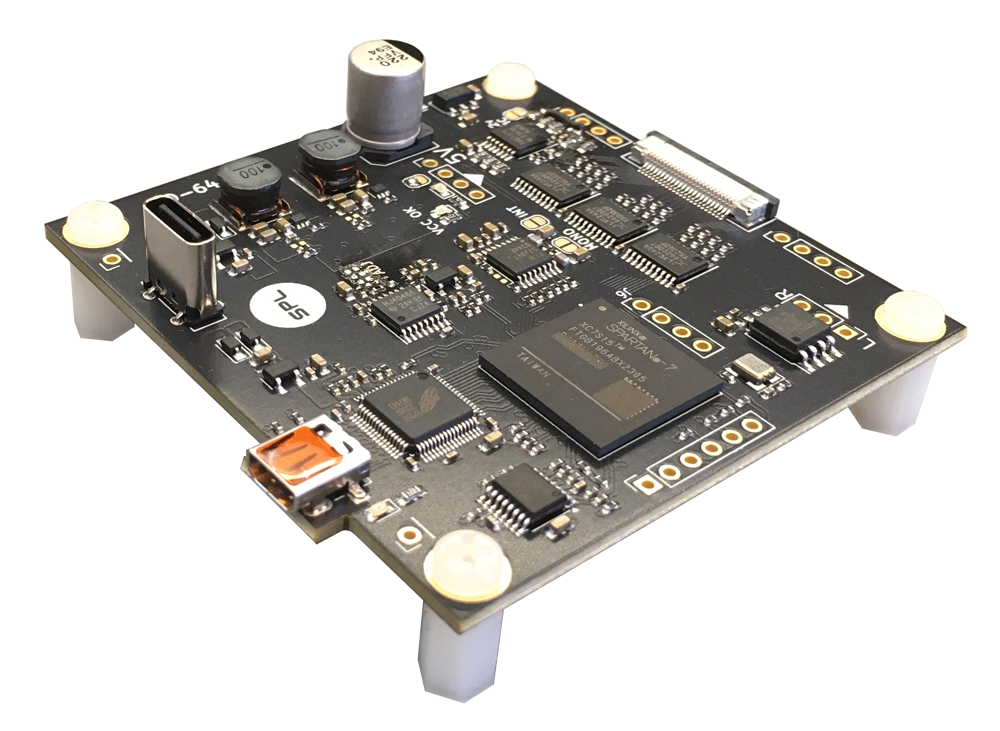

# HD-64

To **REPORT ISSUES** or to simply get in touch with the developer, please join the SPL [Discord](https://discord.gg/gJsCgebkDw) server.

[FULL README (PDF)](https://raw.githubusercontent.com/sideprojectslab/HD-64/main/doc/README.pdf)

HD-64 is an RF-modulator replacement for the Commodore-64 computer which features a Full-HD 50/60Hz Micro-HDMI video+audio output. Crucially, the HD-64 is not a replacement for the VIC-II, which still needs to be mounted on the motherboard

Instead of digitizing the VIC's analog video output signal, the HD-64 "sniffs" the C64's memory bus and recreates a pixel-perfect video output by means of emulation implemented on FPGA. The reconstructed video is then upscaled to Full-HD resolution, merged with the digitized audio from the SID, and sent out as HDMI.

<figure align="center" id="HD-64">
	
	<figcaption>HD-64 Main Board</figcaption>
</figure>

<figure align="center" id="hd64_shortboard_back">
	
	<figcaption>HD-64 Short-Board Assembly</figcaption>
</figure>

<figure align="center" id="hd64_longboard">
	
	<figcaption>HD-64 Long-Board Assembly</figcaption>
</figure>

HD-64 can be purchased pre-assembled from these authorized shops:

- [RetroBuddys](https://www.retrobuddys.com/shop/c64/hd-64-von-spl)
- [Retro8BitShop](https://www.retro8bitshop.com/product/spl-hd-64)
- [Retro-Updates](https://www.retro-updates.com/product/17245372/hd-64-commodore-64-hdmi-output-fpga)

Sales of HD-64 by any shop other than the ones mentioned above may be in violation of the [License](#1-license) terms and conditions and should be reported to the developer

# 1. License
License information is included on top of all software source files as well as in all schematics. Files that do not contain explicit licensing information are subject to the licensing terms stated in the LICENSE.txt provided in the main project folder:

Unless stated otherwise in individual files, all hardware design Schematics, Bill of Materials, Gerber files and manuals are licensed under Creative Commons Attribution-NonCommercial-NoDerivatives 4.0 International. To view a copy of this license, visit http://creativecommons.org/licenses/by-nc-nd/4.0/

Unless otherwise stated in individual files, all software source files are Licensed under the Apache License, Version 2.0. You may obtain a copy of this license at http://www.apache.org/licenses/LICENSE-2.0

# 2. Disclaimer
All material is provided on an 'AS IS' BASIS, WITHOUT WARRANTIES OR CONDITIONS OF ANY KIND in accordance to the license deed applicable to each individual file.

# 3. Contributing
The only open source portion of the HD-64 firmware is the VIC-II emulation written in VHDL, with the rest of the source code not being made available. Even so, **anyone can contribute to changes to the VIC-II emulator, build and test the results without having to access the entire codebase, nor having to set up a local build system**. Builds run directly on the SPL build server and compilation outputs are delivered back to the developers through dedicated GitHub releases. Please find the [Developer's Guide](https://raw.githubusercontent.com/sideprojectslab/HD-64/main/doc/dev_guide.pdf) for detailed information on how to contribute to the project.
